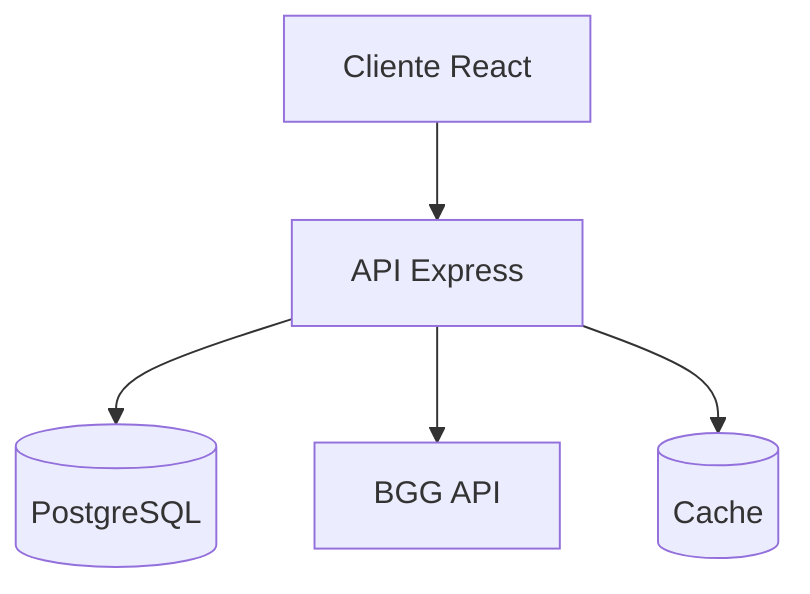
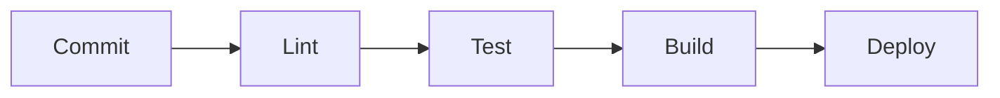
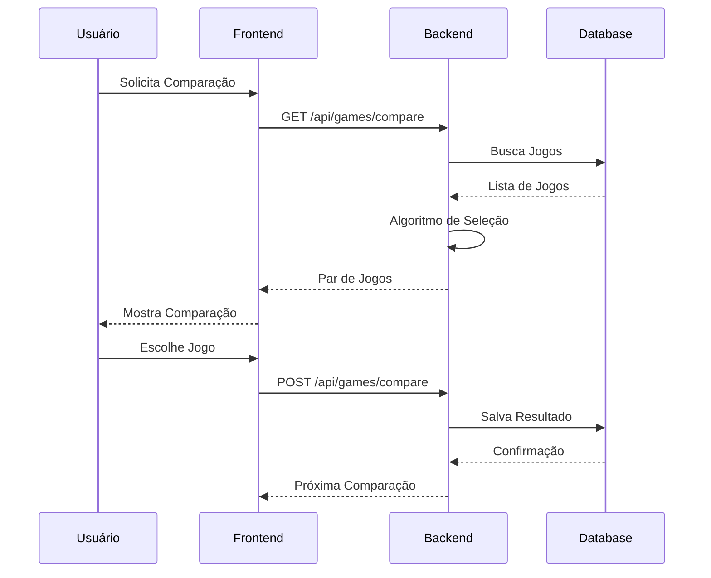

# Arquitetura do Kestrel

## 🏗️ Visão Geral

O Kestrel é uma aplicação full-stack que utiliza uma arquitetura em camadas, separando claramente as responsabilidades entre frontend e backend.



## 🔄 Fluxo de Dados

1. **Autenticação**
   ```mermaid
   sequenceDiagram
       Client->>+API: Login Request
       API->>+DB: Validar Credenciais
       DB-->>-API: Usuário Válido
       API->>API: Gerar JWT
       API-->>-Client: Token + Refresh Token
   ```

2. **Sincronização BGG**
   ```mermaid
   sequenceDiagram
       Client->>+API: Solicita Sincronização
       API->>+BGG: Busca Coleção
       BGG-->>-API: Dados XML
       API->>API: Processa Dados
       API->>+DB: Atualiza Coleção
       DB-->>-API: Confirmação
       API-->>-Client: Status Atualizado
   ```

## 🏛️ Camadas da Aplicação

### Frontend (React + TypeScript)
```
client/
├── src/
│   ├── components/     # Componentes reutilizáveis
│   ├── contexts/       # Contextos React (auth, theme)
│   ├── hooks/         # Hooks personalizados
│   ├── pages/         # Componentes de página
│   ├── services/      # Serviços de API
│   └── utils/         # Utilitários
```

### Backend (Node.js + Express + TypeScript)
```
src/
├── controllers/    # Controladores de rota
├── middleware/     # Middlewares Express
├── services/       # Lógica de negócio
├── utils/         # Utilitários
└── routes/        # Definições de rota
```

## 🔐 Segurança

1. **Autenticação**
   - JWT para tokens de acesso
   - Refresh tokens com rotação
   - Proteção contra CSRF
   - Rate limiting

2. **Dados**
   - Validação com Zod
   - Sanitização de inputs
   - Prepared statements (Prisma)
   - CORS configurado

## 📦 Armazenamento

### PostgreSQL
- Dados persistentes
- Relações complexas
- Transações ACID

### Cache (Node-Cache)
- Dados da BGG API
- Resultados de comparação
- Cache de autenticação

## 🔄 Integração Contínua



## 🚀 Deploy

### Produção
- AWS ECS para containers
- CloudFront para CDN
- RDS para PostgreSQL
- ElastiCache para Redis

### Staging
- Ambiente espelho
- Dados sanitizados
- Testes de integração

## 📊 Monitoramento

1. **Métricas**
   - Tempo de resposta
   - Taxa de erro
   - Uso de recursos
   - Acessos à API

2. **Logs**
   - Winston para logging
   - Níveis de log configuráveis
   - Rotação de logs

## 🔄 Ciclo de Vida dos Dados

1. **Coleta**
   - API BGG
   - Input do usuário
   - Comparações

2. **Processamento**
   - Normalização
   - Cálculo de rankings
   - Ajuste de scores

3. **Armazenamento**
   - Banco de dados
   - Cache
   - Backups

## 📈 Escalabilidade

### Horizontal
- Containers stateless
- Load balancing
- Session sharing

### Vertical
- Otimização de queries
- Índices eficientes
- Caching estratégico

## 🔄 Fluxos Principais

### Comparação de Jogos


## 🔧 Manutenção

1. **Backups**
   - Diários (completos)
   - Incrementais (4/4 horas)
   - Retenção de 30 dias

2. **Updates**
   - Janelas de manutenção
   - Rollback planejado
   - Migrations automáticas

## 📝 Notas Técnicas

1. **Performance**
   - Lazy loading de imagens
   - Compressão de assets
   - Caching em múltiplas camadas

2. **Segurança**
   - HTTPS forçado
   - Headers de segurança
   - Auditoria regular

3. **Qualidade**
   - Testes automatizados
   - Code review
   - Linting rigoroso
